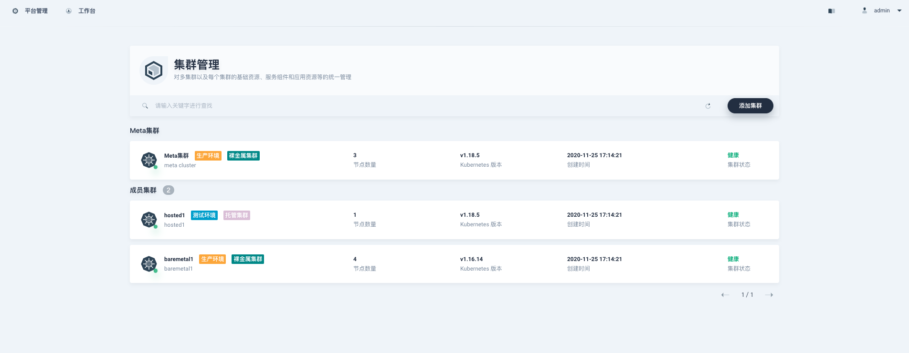
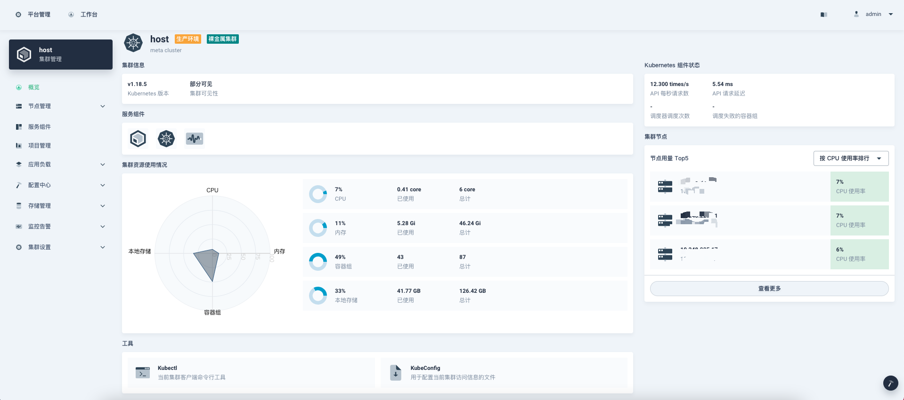
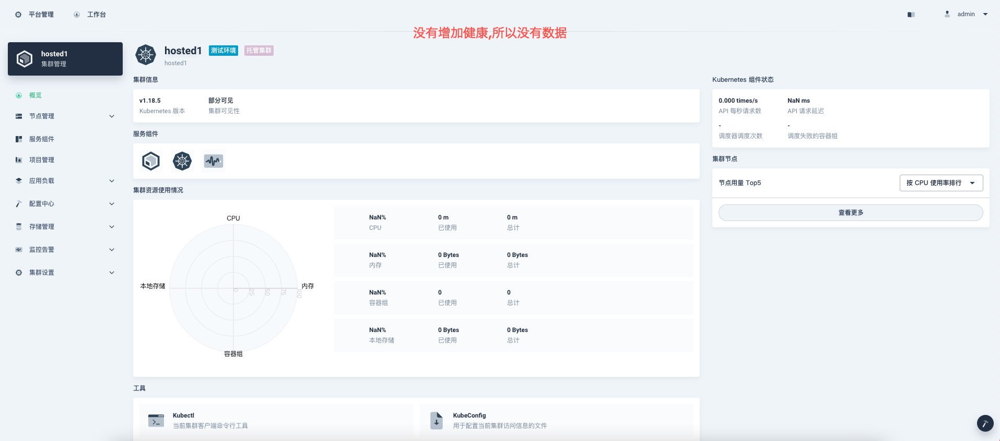
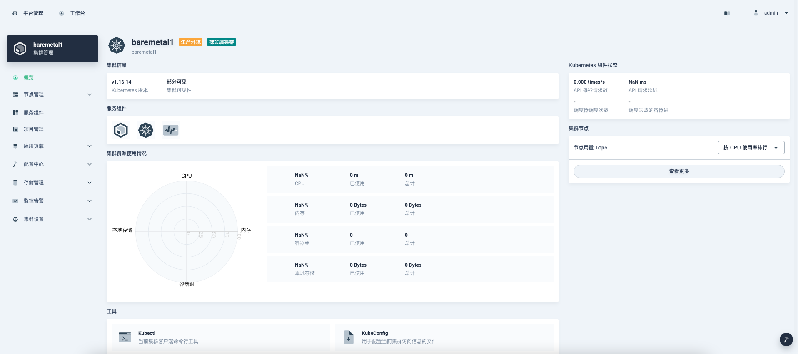

# kunkkka 前端项目

该项目基于青云[Console](https://github.com/kubesphere/console) 改造而成! 

Kunkka Console is the web-based UI for  [Kunkka](https://github.com/gostship/kunkka) clusters.

## Developer Guide

### Preparation

Make sure the following software is installed and added to the \$PATH variable:

- A KubeSphere cluster
- Node.js 10.16+ ([installation with nvm](https://github.com/creationix/nvm#usage))
- Yarn 1.19.1+

Fork the repository, then clone your repository and install the dependencies:

```sh
yarn
```

Note: If you are in China Mainland, execute the following command before running the command above for faster installation.

```sh
yarn config set registry https://registry.npm.taobao.org
```

Start kunkka Console for development  
```sh 
yarn start
```

## 1.Config api server in kunkka Console

Add the file `local_config.yaml` under the folder `server`

local_config.yaml

```yaml
server:
  apiServer:
    url: http://node_ip:30881
    wsUrl: ws://node_ip:30881
```

## 2. Access the services within the KubeSphere cluster

If you are in the same network as the cluster. You can access the ks-apiserver using K8s DNS with the default configuration in `server/config.yaml`

```yaml
server:
  apiServer:
    url: http://ks-apiserver.kubesphere-system.svc
    wsUrl: ws://ks-apiserver.kubesphere-system.svc
```

## 3. 图例
  
支持创建裸金属和托管集群。  






