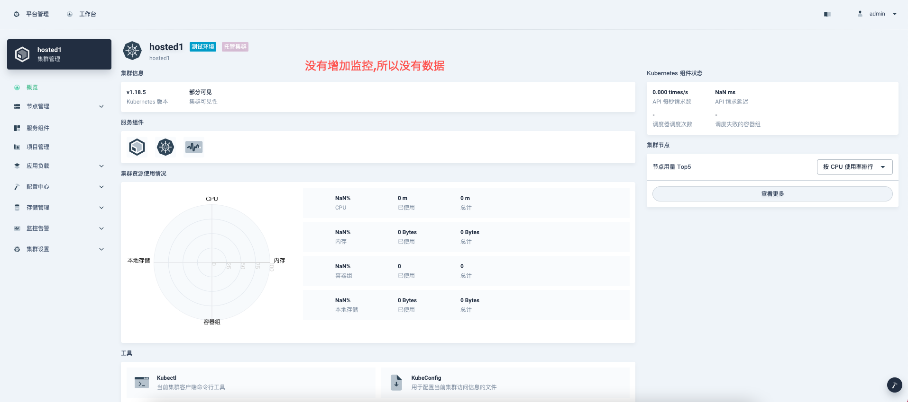

# kunkkka 前端项目

该项目基于青云[Console](https://github.com/kubesphere/console) 改造而成! 


### 环境准备
- Node.js 10.16+ ([installation with nvm](https://github.com/creationix/nvm#usage))
- Yarn 1.19.1+
- 后端程序 ([kubeOnkube-operator](https://github.com/scjianlin/kubeOnkube-operator))

安装前端依赖
```sh
yarn
```

提示: 如果是在大陆,请设置yarn源为国内源。

```sh
yarn config set registry https://registry.npm.taobao.org
```

启动前端项目
```sh 
yarn start
```

## 1. 本地调试

修改server/config.yaml 文件,修改内容如下：

```yaml
server:
  apiServer:
    url: http://node_ip:30881
    wsUrl: ws://node_ip:30881
```

## 2. 集群内部访问
修改server/config.yaml 文件,修改内容如下：
```yaml
server:
  apiServer:
    url: http://ks-apiserver.kubesphere-system.svc
    wsUrl: ws://ks-apiserver.kubesphere-system.svc
```

## 4. 图例
  
支持创建裸金属和托管集群。  





